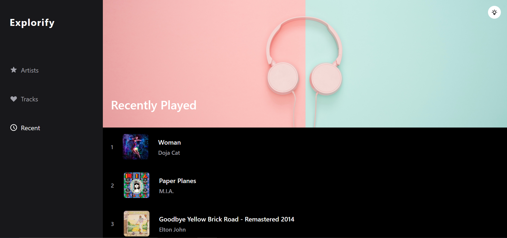
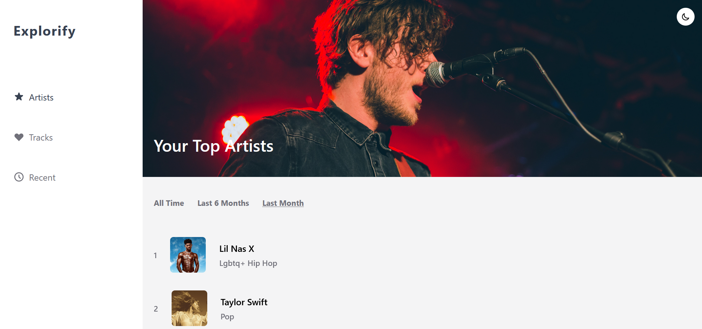
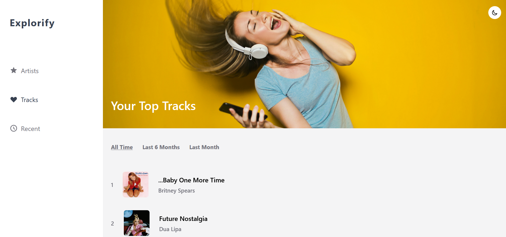

## Explorify

## Overview

- A React app that uses Spotify's Web API to show you insights on your music preferences along with your favourite tracks, artists and recently played songs.

- You can see which songs and artists you have listened to the most over the past month, six months, and year.

- Here is the final production link of the app: [Link](https://explorify-music.netlify.app/)

- It has been built using Create-react-app, Tailwind CSS, Express, and Node.

### Screenshots


<br/> 

<br/>

<br/>

<br/>

### Installation

- Clone and install dependencies locally
```
    git clone https://github.com/saket2508/explorify.git
    cd explorify
    npm install
    cd server
    npm install
    cd..
    cd client
    npm install
```
- Make sure you have installed Node in your system.
- Create a Spotify Developers Account and after you've logged in, create a new application.
- Give your application a name and set the redirect URI to `localhost:3000`
- Then, save its credentials in a `.env.local` file inside the `client` directory.

## Running Locally
- You can start the application in dev mode by running the following command in your terminal.
```
    npm run dev
```
- The server should run on port `localhost:5000` while the client is served on `localhost:3000`

